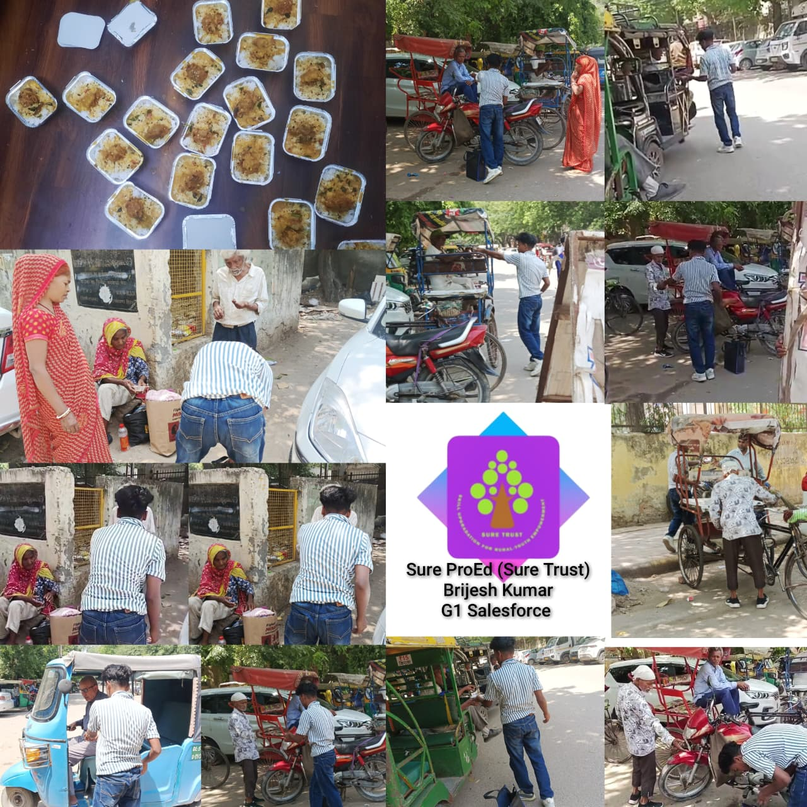
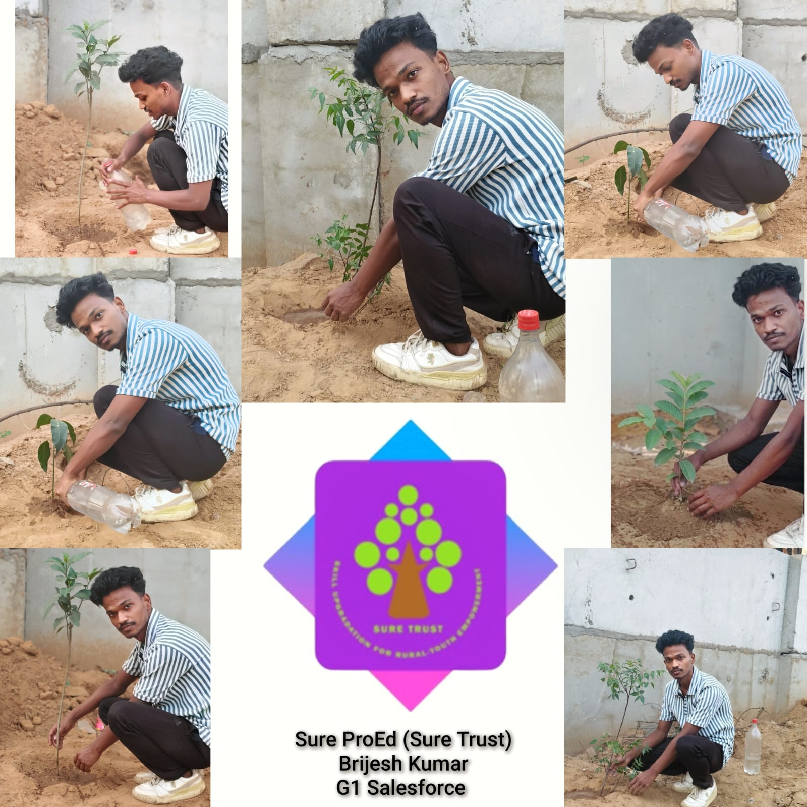

 

    

  <h1 align="center" style="font-family: Arial; font-weight: 600; margin-top: 15px;">SURE ProEd (formerly SURE Trust) 
      </h1>
<h2 style="color: #2b6cb0; font-family: Arial;">Skill Upgradation for Rural youth Empowerment Trust</h2>

<h2 style = "color:#333;"> Student Details </h2>

    
<strong>Name:</strong> Brijesh Kumar 

    
<strong>Email ID:</strong> brijeshkumarg1salesforce@gmail.com 

    
<strong>College Name:</strong> Guru Nanak Institute of Management 

    
<strong>Branch/Specialization :</strong> Computer Application (MCA)

    
<strong>College ID:</strong> 02413004424 

<h2 style="color:#333;"> Course Details </h2>

    
<strong>Course Opted:</strong> Salesforce 

    
<strong>Instructor Name:</strong> Sriram yarrabothula 

    
<strong>Duration:</strong> 6 Months 

<h2 style="color:#333;"> Trainer Details </h2>

<strong>Trainer Name:</strong> Sriram Yarrabothula 

<strong>Trainer Email ID:</strong> yarrabothulasriram@gmail.com 

<strong>Trainer Designation:</strong> Salesforce Developer — RAYON TECHNOLOGY SOLUTIONS PRIVATE LIMITED 

## **Table of Contents**
- [Course Learning](#course-learning-to-be-edited-by-student)
- [Projects Completed](#projects-completed)
- [Project Introduction](#project-introduction)
- [Technologies Used](#technologies-used)
- [Roles and Responsibilities](#roles-and-responsibilities)
- [Project Report](#project-report)
- [Learnings from LST & SST](#learnings-from-lst--sst)
- [Community Services](#community-services)
- [Certificate](#certificate)
- [Acknowledgments](#acknowledgments)

## Overall Learning 

> _My professional summary based on the extensive Salesforce Administration and Development syllabus you provided, tailored to reflect a strong architectural and developer skill set._

During this course, I developed a comprehensive understanding of the Salesforce ecosystem, spanning both declarative Administration and programmatic Development. I gained hands-on experience in cloud architecture, complex data modeling, organizational security controls, and advanced process automation using Flows and Approval Processes. On the development side, I strengthened my technical capabilities by writing robust Apex code—mastering triggers, asynchronous processes, and comprehensive test classes. Additionally, I built responsive, modern user interfaces utilizing Lightning Web Components (LWC) and deepened my systems architecture expertise by integrating Salesforce with external platforms via REST/SOAP APIs, equipping me to design and deliver highly scalable, real-world CRM solutions.

<h2 style="color:#333;"> Projects Completed </h2>

<strong><a href="#project1">Project 1:</a></strong> &lt; Travel and Expense Management System &gt;

<!-- Project 1 -->
<h3 id="project1">Project 1: Travel and Expense Management System </h3>

This project involved designing and developing a Travel and Expense Management System using Salesforce. It was built using the core concepts learned during the internship, including data modeling, object relationships, validation rules, and process automation. The project focused on creating custom objects such as Travel Requests, Expenses, and Expense Reports, and implementing functionalities like expense entry, report submission, and approval processes.
I used Screen Flows, Record-Triggered Flows, and Apex to automate business logic and ensure smooth data handling. The system was designed to manage the complete lifecycle of travel and expense tracking, from request creation to reimbursement. This project helped me understand real-world requirements, build structured solutions, and apply Salesforce development and administrative concepts effectively.

  <a href="project.pdf" target="_blank"><strong>→ View Full Project Report</strong></a>

## **References**

- [Lightning Web Components Developer Guide](https://developer.salesforce.com/docs/platform/lwc/guide/get-started-component-library.html)
- [Lightning Component Library](https://developer.salesforce.com/docs/platform/lightning-component-reference/guide/components.html)  
- [Apex Developer Guide](https://developer.salesforce.com/docs/atlas.en-us.apexcode.meta/apexcode/apex_dev_guide.html)  
- [Call Apex Methods in LWC](https://developer.salesforce.com/docs/platform/lwc/guide/apex.html)
- [Wire Apex Methods to LWC](https://developer.salesforce.com/docs/platform/lwc/guide/apex-wire-method.html)  
- [Salesforce Flow Documentation](https://developer.salesforce.com/docs/platform/lwc/guide/use-flow.html)
- [Salesforce Developer Portal](https://developer.salesforce.com/docs)  
- [Trailhead: Use Apex with LWC](https://trailhead.salesforce.com/content/learn/modules/lightning-web-components-and-salesforce-data/use-apex-to-work-with-data)
---

## **Learnings from LST and SST**

<!-- add your experiences over here -->
> _LST (Life Skill Training) sessions played an important role in improving my overall personal and professional development. These sessions were conducted regularly (on alternate Sundays), where each session focused on different real-life skills._
LST and SST sessions helped me....

Through LST sessions, I learned the importance of effective communication, which helps in both personal interactions and professional environments. Sessions on Emotional Quotient (EQ) helped me understand how to manage emotions and handle situations calmly. I also gained knowledge about personal finance management, including saving, budgeting, and financial planning.
In addition, topics like entrepreneurship, negotiation skills, and workplace dynamics gave me insight into real-world corporate environments. Sessions on interview skills and career guidance, including the future of careers in AI and Data, helped me prepare for upcoming job opportunities.
Overall, these sessions improved my confidence, communication skills, decision-making ability, and career awareness.

---

## **Community Services**

<!-- add descreption in your own words -->

During my internship period, I participated in multiple community-oriented activities .....<!-- add descreption in your own words -->

### **Activities Involved**
  <!-- add the location where you have panted -->
- **Tree Plantation Drive** – Planted trees along nearby roads/street areas to promote a cleaner and greener environment.

  <!-- add the location where you helped -->
- **Helping Elder Citizens** – Assisted two elderly individuals with simple daily tasks and provided support where needed. 

<!-- you can write impacts according to your experience in your words-->

### **Impact / Contribution**

- Actively participated in promoting a greener and cleaner surroundings.
- Offered personal assistance to elder citizens, strengthening community bonds.
- Improved skills in communication, coordination, and social responsibility.
- Developed a sense of social responsibility, empathy, and teamwork.

### **Photos**

<!-- add your photos below -->
<!-- change url below with your image urls (inside  src='')-->

- These are just placeholder (sample) images <!-- remove this line -->

---

## **Certificate**

The internship certificate serves as an official acknowledgment of the successful completion of my training period. It will be issued by the organization upon fulfilling all required tasks and meeting the performance expectations of the program. The certificate validates the skills, experience, and contributions made during the internship.

<!-- add your certificate image url below (inside src='')-->

---

## **Acknowledgments**

<!-- you can add Acknowledgments over here in same syntax as below . eg trainer name , company name , role etc -->

- [Prof. Radhakumari Challa](https://www.linkedin.com/in/prof-radhakumari-challa-a3850219b) , Executive Director and Founder - [SURE Trust](https://www.suretrustforruralyouth.com/)

